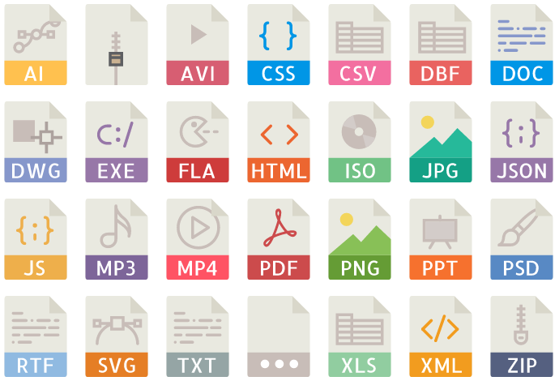

# Pretty File Icons

Pretty colorful icons for files (in svg format)

I found these awesome icons some time ago somewhere in the internet, and 
currently do not have any info about the author. That's why at this moment 
the licence is (temporarily) MIT; if somebody wish to claim their copyrights -
please send me an email with proofs - and I'll change the licence (or do
anything else that you'll require with this repository).
 
## Usage
 
Just download image files and use them. Also, this package is available on NPM:
```
npm install pretty-file-icons
```
 
In addition, this package contains mapping for some file extensions - see the
[index.json](index.json) file. Also, it can be used in javascript applications 
to retrieve icon names by file name:
```javascript
var prettyFileIcons = require('pretty-file-icons');

console.log(prettyFileIcons.getIcon('test.csv'));
console.log(prettyFileIcons.getIcon('test.csv', 'svg'));
console.log(prettyFileIcons.getIcon('.test', 'svg'));

// Prints:
// csv
// csv.svg
// unknown.svg
```
  
## Preview:
  
  
